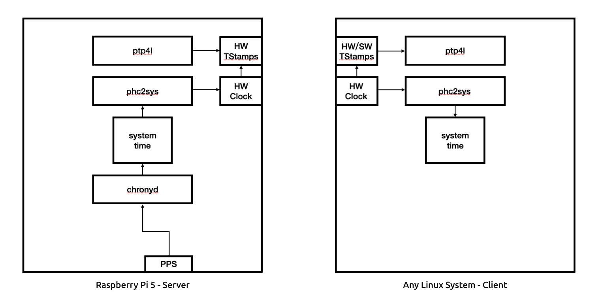

# Raspberry Pi 5 synchronized only with PPS acting as PTP timeserver

This repository contains instructions for building a Raspberry Pi 5 PTP timeserver with the following properties:

- Long-term synchronization is based solely on a PPS without any additional information.
- The PPS can be isolated, i.e. without synchronization with a common time standard such as TAI/UTC/GPST. Therefore, the PPS can be provided by any generic signal generator.
- Only during the boot process does the Pi 5 attempt to query public NTP servers for a limited duration to align its system time. After that, the system time only depends on the PPS and may slowly start to deviate from common time standards.
- The use case is a semi-isolated system. It has access to NTP servers synchronized with UTC, but no access to a PTP master or any precise hardware reference clock synchronized with a common time standard, for instance a GPS-derived PPS due to being indoors. 

## System Overview

  

For comparison, a similar system with GPS as the hardware reference clock:

[System Overview with GPS](https://github.com/parlaynu/pi5-timeserver-gps-pps/blob/main/docs/system.png)

## Server

Instructions for the server setup are [here](docs/server.md).

## Client

Instructions for the client setup are [here](docs/client.md).

## Acknowledged

This project is a fork of this [repository](https://github.com/parlaynu/pi5-timeserver-gps-pps).

## Useful Links

- [ptp4l High Values of Master offset freq and path delay](https://stackoverflow.com/a/66027431)
- [Creating an isolated NTP server with only 1PPS](https://unix.stackexchange.com/a/688159)
