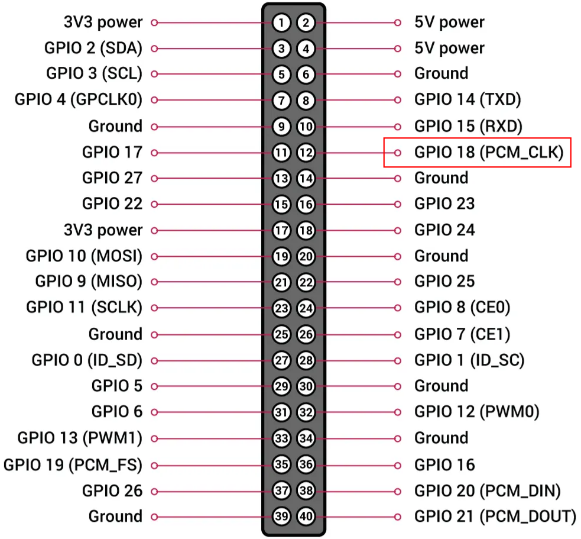

# Raspberry Pi5 Time Server Setup

These instructions setup the Pi5 as a PTP timeserver with a PPS as the only hardware reference clock.

1. [PPS](#pps)
2. [OS Installation](#os-installation)
3. [OS Configuration](#os-configuration)
4. [Chrony](#chrony)
5. [PTP Server](#ptp-server)
5. [Logging](#logging)

## PPS

The PPS signal generation was tested with a signal generator from the Tektronix AFG3000C series. The PPS amplitude should be 3.3V as the Raspberry Pi is a 3.3V device. The duty cycle was set to 25%.

## OS Installation

Use the [Raspberry Pi Imager](https://www.raspberrypi.com/software/) to install the OS on an SD card. Follow the [getting started](https://www.raspberrypi.com/documentation/computers/getting-started.html) instructions to install and configure the operating system.

All settings were tested on:

Follow the instructions to the point where your Pi is on your network and you can log in.

## OS Configuration

Edit `/boot/firmware/config.txt` and add this line at the end:

    dtoverlay=pps-gpio,gpiopin=18

Reboot. Connect the PPS to the Raspberry Pi at GPIO 18 and any GND:

  

Install the `pps-tools` package:

    sudo apt install pps-tools

Verify the PPS input by running:

    defuser@pi5-pps-ptp:~ $ sudo ppstest /dev/pps0
    trying PPS source "/dev/pps0"
    found PPS source "/dev/pps0"
    ok, found 1 source(s), now start fetching data...
    source 0 - assert 1738936729.000005435, sequence: 164 - clear  0.000000000, sequence: 0
    source 0 - assert 1738936730.000004699, sequence: 165 - clear  0.000000000, sequence: 0
    source 0 - assert 1738936731.000003518, sequence: 166 - clear  0.000000000, sequence: 0

## Chrony

Install `chrony`:

    sudo apt install chrony

This also uninstalls `systemd-timesyncd`.

Deactivate this lines in `/etc/chrony/chrony.conf`:

    #makestep 1 3

Add these lines to `/etc/chrony/chrony.conf`:

    # initially stepping system time if error > 0 seconds
    initstepslew 0.01 time.google.com time.cloudflare.com time.apple.com time.aws.com

    # https://blog.lns.com/?p=210
    refclock PPS /dev/pps0 refid PPS0 trust

    # local: isolated network
    # stratum 1 orphan: ignore any sources of stratum 1 if PPS is available
    local stratum 1 orphan

> **_NOTE:_** [As an alternative](https://unix.stackexchange.com/a/688159), it is also possible to change the last line to `local stratum 10` and remove all NTP servers by commenting the line `pool 2.debian.pool.ntp.org iburst`. 

Add this line to `/etc/systemd/system/chronyd.service`:

    # https://bugzilla.redhat.com/show_bug.cgi?id=745709
    ExecStartPre=/usr/bin/nm-online -q -t 30

Restart `chrony` so the updated configuration takes effect:

    sudo systemctl restart chrony

Make sure `chrony` is running properly:

    chronyc sources

## PTP Server

Install the necessary packages:

    sudo apt install linuxptp

Edit `/etc/linuxptp/ptp4l.conf` and change the following values:

    priority1               127
    masterOnly              1
    domainNumber            55

The default value `domainNumber 0` should be changed in case another PTP master already uses the default value.

Add these lines to `/lib/systemd/system/ptp4l@.service`:

    # https://github.com/raspberrypi/linux/issues/5881
    After=network-online.target
    Wants=network-online.target

Start the service:

    sudo systemctl enable ptp4l@eth0
    sudo systemctl start ptp4l@eth0

To synchronize the PHC with the system clock (which in turn is synchronized with the PPS), `phc2sys` is used. Despite its name, it can also force the system time onto the PHC.

Create a new systemd service file:

    cd /lib/systemd/system
    sudo cp phc2sys\@.service sys2phc-eth0.service

Then edit `/lib/systemd/system/sys2phc-eth0.service` lines to match:

    Requires=ptp4l@eth0.service
    After=ptp4l@eth0.service

    ExecStart=/usr/sbin/phc2sys -w -c eth0 -s CLOCK_REALTIME -n 55

You can add `-q` to the `phc2sys` command to stop it from sending a log message every second.

Start the service:

    sudo systemctl daemon-reload
    sudo systemctl enable sys2phc-eth0
    sudo systemctl start sys2phc-eth0

At this point, the PPS dictates the system time, the system time dictates the PHC, and the PTP server is using the PHC for hardware time stamping.

## Logging

    journalctl -f -u ptp4l@eth0
    journalctl -f -u sys2phc-eth0
